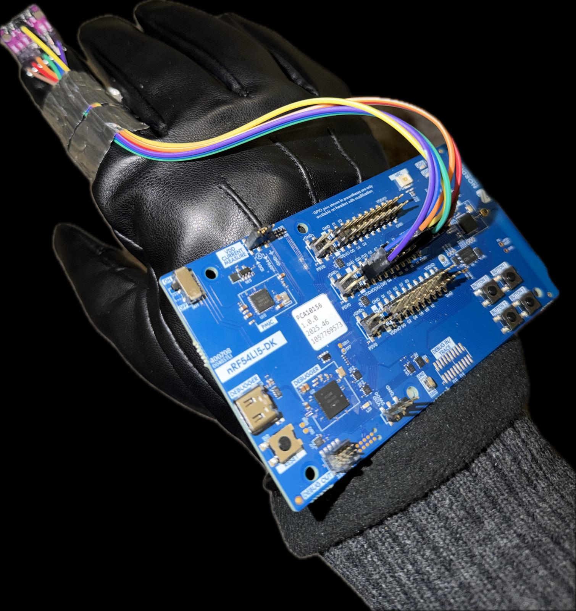

# LSM6DS3 Gesture Recognition System with Nordic nRF54L15-DK

## Table of Contents
- [Introduction](#introduction)
- [Hardware Details](#hardware-details)
- [Software Environment](#software-environment)
- [Reproducibility Guide](#reproducibility-guide)
- [Troubleshooting](#troubleshooting)

---

## Introduction

### Problem Statement
Traditional human-computer interaction relies heavily on physical input devices (keyboards, mice, touchscreens). This project addresses the need for intuitive, contactless gesture-based control systems suitable for applications in:
- VR/AR environments
- Accessibility tools for users with limited mobility
- Industrial/medical settings requiring hands-free operation
- Smart home/IoT device control

### Target Application
A wearable gesture recognition glove that translates hand movements into wireless commands for mobile devices, laptops, and IoT systems via Bluetooth Low Energy (BLE).

### High-Level Architecture
```
┌─────────────────────────────────────────────────┐
│  LSM6DS3 IMU Sensor (Finger-mounted)            │
│  ├─ Accelerometer (±2g to ±16g)                │
│  └─ Gyroscope (±125 to ±2000 dps)              │
└────────────────┬────────────────────────────────┘
                 │ I2C/SPI
                 ▼
┌─────────────────────────────────────────────────┐
│  Nordic nRF54L15-DK (Processing Unit)          │
│  ├─ Background Thread: Circular Buffer (100)   │
│  ├─ IMU Interrupt: Jolt Detection              │
│  ├─ ML Inference Engine                        │
│  │  ├─ Random Forest (gesture_app_rf)          │
│  │  └─ CNN TFLite (gesture_app_cnn)            │
│  └─ BLE Stack (Bluetooth 5.4)                  │
└────────────────┬────────────────────────────────┘
                 │ BLE GATT
                 ▼
┌─────────────────────────────────────────────────┐
│  Client Device (Mobile/Laptop)                  │
│  └─ Gesture Command Interpreter                │
└─────────────────────────────────────────────────┘
```

### Key Features
- **8 Gesture Classes**: Slide Up, Slide Down, Slide Right, Slide Left, Tap, Double Tap, Static, None
- **Dual ML Models**: 
  - Random Forest (currently superior performance)
  - CNN (TensorFlow Lite optimized)
- **Interrupt-Driven Inference**: IMU hardware interrupt triggers on significant motion jolt
- **Smart Windowing**: 100-sample window (50 pre-jolt, 50 post-jolt) captures complete gesture signature
- **Low Latency**: <50ms inference time (Random Forest)
- **Wireless Range**: 10-15m typical BLE range
- **Energy Efficient**: Interrupt-driven architecture minimizes active processing time

### Performance Summary
| Metric | Value |
|--------|-------|
| **Inference Latency** | 30-50ms (RF), 60-80ms (CNN) |
| **Gesture Accuracy** | 91-94% (RF), 80-83% (CNN) |
| **Sampling Rate** | 100Hz (IMU) |

---

## Hardware Details

### i. Board and MCU
*   **Core**: Nordic Semiconductor **nRF54L15** (ARM Cortex-M33).
*   **Development Kit**: nRF54L15DK.

### ii. Additional Peripherals
*   **IMU**: STMicroelectronics **LSM6DS3** (6-axis Accelerometer and Gyroscope).
*   **Interface**: I2C protocol for sensor data acquisition.

---

## Physical Assembly

### i. Glove Integration:


*Figure 1: LSM6DS3 mounted on index finger and connected to nrf54l15dk attached to a glove*

:

┌─────────────────────────────────────┐
│                                     │
│         -Z (Toward Finger Tip)      │
│              ▲                      │
│              │                      │
│              │                      │
│    +Y        │        +X            │
│   (Up)       └────────►             │
│   ⊙          (Toward Middle Finger) │
│                                     │
│   LSM6DS3 Sensor                    │
│  (Top view)                         |
│                                     │
└─────────────────────────────────────┘
```
---

## Software Environment

### i. Firmware
*   **Toolchain**: nRF Connect SDK (NCS) **v3.2.1**.
*   **RTOS**: Zephyr RTOS.
*   **Build System**: West / CMake.

### ii. Machine Learning Module
The repository contains two distinct inference approaches for gesture classification:
*   **Random Forest (`gesture_app_rf`)**: The recommended implementation due to superior stability and lower resource overhead on the nRF54.
*   **CNN (`gesture_app_cnn`)**: An alternative deep learning approach for experimental comparison.
*   **Training**: Developed using Python 3.11, Scikit-learn, and NumPy.

### iii. Radio Stack
*   **Protocol**: Bluetooth Low Energy (BLE) 5.4.
*   **Profile**: HID Over GATT (HOGP).
*   **Appearance**: Keyboard (961).

---

## Reproducibility Guide

### i. Prerequisites & Environment Setup
1.  **Clone the Repository**:
    ```bash
    git clone <your-repo-url>
    cd <repo-name>
    
2. **VS Code Extension**: Install the nRF Connect for VS Code Extension Pack.
3. **SDK Version**: Ensure you are using nRF Connect SDK (NCS) v3.2.1.
4. **Toolchain**: Verify that the toolchain is correctly linked within the VS Code extension settings to match the SDK version.

### ii. Hardware Assembly
1. Connect the LSM6DS3 IMU to the nRF54L15DK according to the following pin map:
   
  | Breakout Pin | DK Pin | Notes |
  |-------------|--------|-------|
  | VIN | VDD.IO | 3.3V power |
  | GND | GND | Ground |
  | SDA | P1.11 | I2C data |
  | SCL | P1.12 | I2C clock |
  | CS | VDD.IO (tie high) | Selects I2C mode over SPI |
  | SAO | GND (tie low) | Sets I2C address to 0x6A |
  | INT1 | P1.13 | Data-ready interrupt (trigger) |
  
2. Ensure that the orientation of IMU is same as previously shown

### iii. Build and Flash Instructions

You can build either the Random Forest or the CNN version of the application

#### Option A: Random Forest (gesture_app_rf) - Recommended

This version is more stable and resource-efficient for the nRF54L15.
  ```bash
  cd gesture_app_rf
  rm -rf build/
  west build -b nrf54l15dk/nrf54l15/cpuapp
  west flash
  ```

#### Option B: CNN (gesture_app_cnn)

**Note**: To build the CNN app, the tflite-micro library must be manually added to your Zephyr allowlist.

1. Update your west.yaml file to include tflite-micro to the zephyr allowlist

2. Run the following command to sync the library:
   ```bash
   west update -f always

4. Build and Flash:
    ```bash
    cd gesture_app_cnn
    rm -rf build/
    west build -b nrf54l15dk/nrf54l15/cpuapp
    west flash
    ```

### iv. Running the Demo

* **Pairing**: Once flashed, the device will advertise as "GestureRing".
* **Connection**: Open the Bluetooth settings on your phone or laptop and connect to the device.
* **Gestures**: After connecting, perform gestures to control your device.

**Note**: Gestures are optimized for navigation in Safari and Chrome and may not work on some applications.


## Troubleshooting

**Device Not Visible**: If "GestureRing" does not appear in your Bluetooth list:

* Press the RESET button on the nRF54L15DK.
* Toggle Bluetooth OFF and ON on your laptop or phone to refresh the cache.

**Pairing Fails**:
* Forget the "GestureRing" device phone 
* Erase nrf54l15dk 
* Flash nrf54l15dk

**Gestures No Longer Working**: 
* Forget the "GestureRing" device phone 
* Reset nrf54l15dk 
* Pair to "GestureRing" again

**Missing TFLite Libraries**: If the CNN build fails with missing library errors, double-check that your *west.yaml* was modified correctly and that you ran **west update -f always**.

**I2C Errors**: Ensure the jumpers are securely connected to the correct pins.

---
